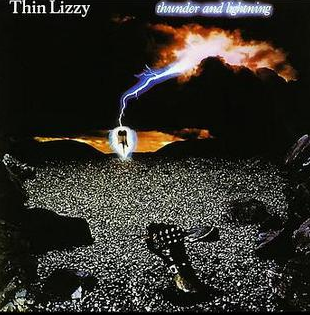

+++
title = "You Should Listen: Thunder and Lightning - Thin Lizzy"
date = 2020-06-15

[taxonomies]
tags = ["you-should-listen", "thin-lizzy", "june-2020", "2020"]
authors = ["dangerous_l"]
categories = ["You Should Listen"]
+++

# This Is The One

**You Should Listen** is a thing where I post about some music that I'm (probably) listening to that I think would be great if we got together and listened to together. I'm not going to tell you where to find it or anything, but I might provide a track off youtube if I can find it. 

Additionally, I make no promises to actually writing anything about these suggestions other than to just suggest them.

With that out of the way...

Just imagine it now... I call you up on the telephone, hoping either you or one of your parents picks up and not your jerk older sibling that thinks we're nerds. "Hey, want to come over and listen to some Thin Lizzy?"

Maybe you're tired of sitting around at home. Maybe you were just looking for an excuse to hang out and play some _Sword of Fargoal_ on the C64.

But, maybe you're genuinely are interested to hear what I meant when you heard the garbled words "Thin Lizzy's new LP" come through the corded phone hanging off the wall in your parent's kitchen. You hop on your bike and pedal down to my end of the neighborhood.

<!-- more -->

## Lynott's Unintended Farewell

I don't mean to go too far into history on these but here we are.

This is Thin Lizzy's twelfth and final LP. They would go on a tour to support this album, but break up shortly thereafter.

If you know anything of Thin Lizzy, you might recognize the name _Phil Lynott_. The principal songwriter, vocalist, and bassist of the band, he would unfortunately pass away from drug-related issues 3 years after the release of this album in 1986.

In my opinion, his abilities and this band in general are criminally underrated in the 70s-80s hard rock genre.

## What Will Catch You

If you listen to just the "top track" off this album (according to Apple Music, anyway), you'll listen to _Cold Sweat_.

Here's a video that you probably need to open in a youtube tab: 

{{ youtube(id="hHG9wXCpdTI") }}

_Cold Sweat_ is bad ass. It's only 3:07 long, so in the time it would take me to type out anything to tell you why, you could just decide on your own.

 The opening guitar riff is catchy enough, but really, you're going to get about 1:25 into the song and be overrun by some masterful shredding that will continue through the rest of the track.

## What Will Keep You Coming Back
Thin Lizzy puts together an effort that includes everything from straight up ass-kicking guitar expositions like _Someday She Is Going to Hit Back_, sweeping soundscapes as heard in _The Sun Goes Down_, and even hit you with the classic Thin Lizzy feels (in my estimation) with _Bad Habits_ or _Heart Attack_. 

Songs like _The Holy War_ and _This is the One_ have some deeper lyrical content, and I always enjoy the introspection that this type of story sparks.

Rhythmically, there's some cool stuff beyond the normal 4/4 feels to be found here, too. Check out _The Holy War_, if you didn't.

## My Favorite Tracks

The whole thing is great, but I'll try to stick with 3 favorites.

- The Holy War
- Cold Sweat
- Baby Please Don't Go